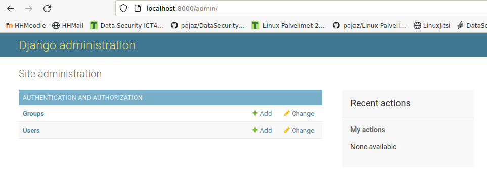
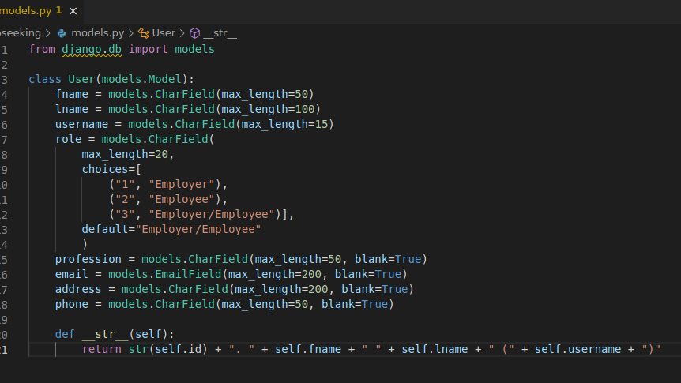
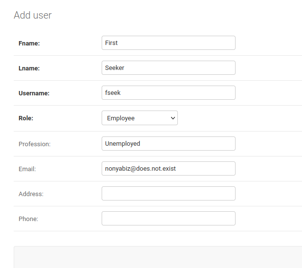
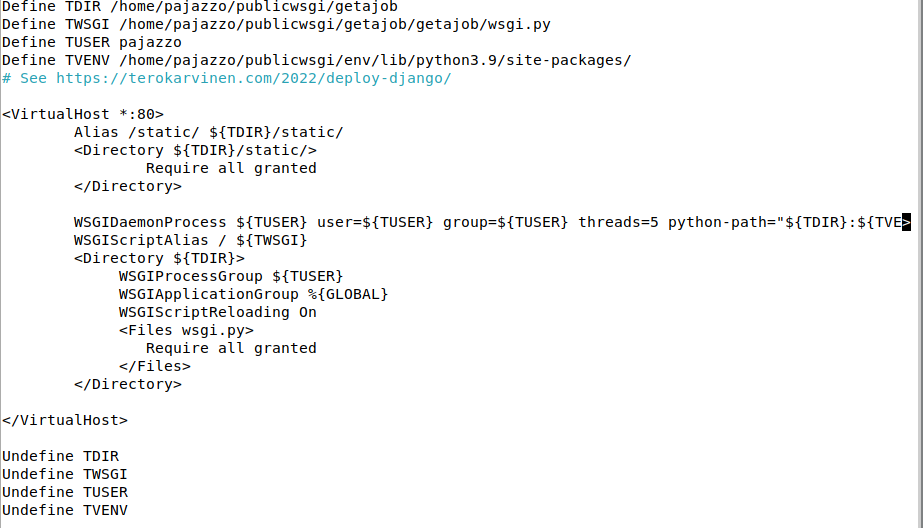
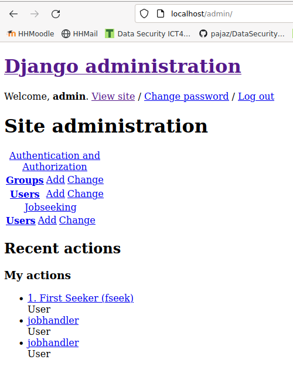
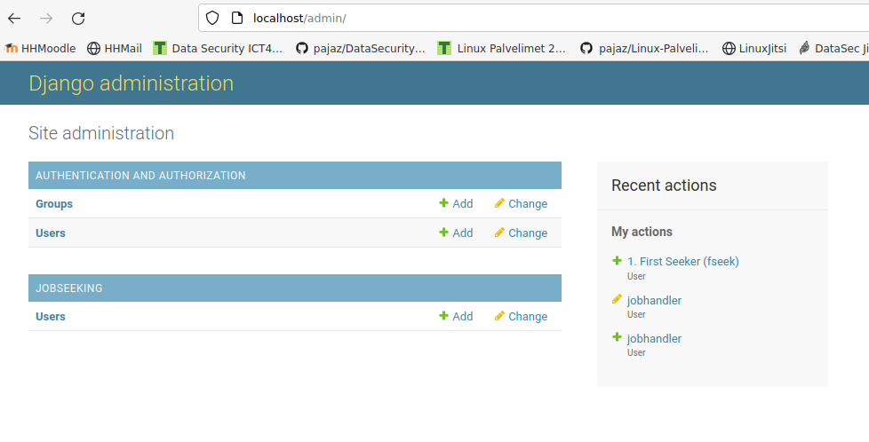

# Luento 5 Kotitehtävät
  
Osa kurssia Linux Palvelimet ICT4TN021-3018 Haaga-Helia Ammattikorkeakoulussa  
Kurssin vetäjä: [Tero Karvinen](https://terokarvinen.com/2021/linux-palvelimet-ict4tn021-3018/)  

## DJ Ango!

### a) CRUD. Make a simple web program, that allows multiple users modify the same data. Have user accounts and logins. You can use Django development server and admin interface here. Single table is enough. We already did a Customer (CRM) database, so it might be interesting to do something as simple, but slightly different.  

Sources for this part:   
https://www.digitalocean.com/community/tutorials/how-to-use-postgresql-with-your-django-application-on-ubuntu-20-04  
https://terokarvinen.com/2022/django-instant-crm-tutorial/  
  
Operating system: Debian 11 Bullseye  
  
Requirements:  
- Python  
- virtualenv  
- pip
- Django  
- PostgreSQL  
- psycopg2  

Text editors:  
- micro for smaller editing.    
- Visual Studio Code for doing more complex work.  

I have most of the requirements already installed on my system:  
pajazzo@derpface:\~/Projects/Linux-Palvelimet-2022/Homework/Lesson06$ python3 --version  
Python 3.9.2  
pajazzo@derpface:\~/Projects/Linux-Palvelimet-2022/Homework/Lesson06$ virtualenv --version  
virtualenv 20.4.0+ds from /usr/lib/python3/dist-packages/virtualenv/\__init__.py  
pajazzo@derpface:\~/Projects/Linux-Palvelimet-2022/Homework/Lesson06$ pip --version  
pip 20.3.4 from /usr/lib/python3/dist-packages/pip (python 3.9)   
pajazzo@derpface:\~/Projects/Linux-Palvelimet-2022/Homework/Lesson06$ psql --version  
psql (PostgreSQL) 13.5 (Debian 13.5-0+deb11u1)  
    
Django nd psycopg2, i will install inside the virtual environment, using pip packet manager.  
  
### Creating the Database in Postgresql  
  
(env) pajazzo@derpface:\~/Projects/getajob$ sudo -u postgres psql  
could not change directory to "/home/pajazzo/Projects/getajob": Permission denied  # No idea what this error means but psql opened  
psql (13.5 (Debian 13.5-0+deb11u1))  
Type "help" for help.  
  
postgres=# CREATE DATABASE getajob  
postgres-# ;  
CREATE DATABASE  
postgres=# CREATE USER jobadmin WITH PASSWORD 'verydifficult';  
CREATE ROLE  
postgres=# GRANT ALL PRIVILEGES ON DATABASE getajob TO jobadmin;  
GRANT  
postgres=# \q
  
### Setting up the Virtual environment and installing requirements
   
I set up a new virtual environment and activated it:  
pajazzo@derpface:\~$ virtualenv --system-site-packages -p python3  env/  
created virtual environment CPython3.9.2.final.0-64 in 116ms  
  creator CPython3Posix(dest=/home/pajazzo/env, clear=False, no_vcs_ignore=False, global=True)  
  seeder FromAppData(download=False, pip=bundle, setuptools=bundle, wheel=bundle, via=copy, app_data_dir=/home/pajazzo/.local/share/virtualenv)  
    added seed packages: pip==20.3.4, pkg_resources==0.0.0, setuptools==44.1.1, wheel==0.34.2  
  activators BashActivator,CShellActivator,FishActivator,PowerShellActivator,PythonActivator,XonshActivator  
pajazzo@derpface:\~$ source env/bin/activate  
(env) pajazzo@derpface:\~$  
  
Everything started without a problem.  
I made sure pip doesn't install anything outside the venv, created the requirements.txt (only Django), installed the requirements and checked that Django version is correct:    
(env) pajazzo@derpface:\~$ which pip  
/home/pajazzo/env/bin/pip  
(env) pajazzo@derpface:\~$ echo "django" | tee requirements.txt  
django  
(env) pajazzo@derpface:\~$ cat requirements.txt   
django  
(env) pajazzo@derpface:\~$ pip install -r requirements.txt  
(env) pajazzo@derpface:\~$ django-admin --version  
4.0.3  
(env) pajazzo@derpface:\~/Projects$ pip install psycopg2  <- Forgot to add to requirements so I just installed it with the command.  
Collecting psycopg2  
  Using cached psycopg2-2.9.3-cp39-cp39-linux_x86_64.whl  
Installing collected packages: psycopg2  
Successfully installed psycopg2-2.9.3  
  
### Starting the project and making database connections  
  
(env) pajazzo@derpface:\~/Projects$ django-admin startproject getajob  
(env) pajazzo@derpface:\~/Projects$ cd getajob/  
(env) pajazzo@derpface:\~/Projects/getajob$ micro getajob/settings.py   
  
Edited the section DATABASES to following so that the application is actually set up for postgresql:  
DATABASES = {  
    'default': {  
        'ENGINE': 'django.db.backends.postgresql',   
        'NAME': 'getajob',  
        'USER': 'jobadmin',  
        'PASSWORD': 'verydifficult',  
        'HOST': 'localhost',  
        'PORT': '',  
    }  
}  
  
and the section ALLOWED_HOSTS to the following so that we can actually connect to the previously defined HOST:  
ALLOWED_HOSTS = ['localhost']  
  
No to test the database connection, create a superuser for the admin portal and run the application for the first time:  
(env) pajazzo@derpface:\~/Projects/getajob$ ./manage.py makemigrations  
No changes detected  
(env) pajazzo@derpface:\~/Projects/getajob$ ./manage.py migrate  
(env) pajazzo@derpface:\~/Projects/getajob$ ./manage.py createsuperuser    
   
  
  
All worked out fine. On we go.  
Tested out creating a new user through the admin portal:  
  
Also gave him staff and superuser roles.  
  
### Creating a Database for Job seeking  
    
(env) pajazzo@derpface:\~/Projects/getajob$ ./manage.py startapp jobseeking  
(env) pajazzo@derpface:\~/Projects/getajob$ micro getajob/settings.py   
Edited the following:  
INSTALLED_APPS = [  
    'django.contrib.admin',  
    'django.contrib.auth',  
    'django.contrib.contenttypes',  
    'django.contrib.sessions',  
    'django.contrib.messages',  
    'django.contrib.staticfiles',  
    'jobseeking',  
]  
  

Created a user model:  
  
  
Registered the new table in jobseeking app's admin.py file:  
from django.contrib import admin  
from . import models  
  
admin.register.site(models.User)  

And a test:   
  
  
Added our first job seeker:  
  
  
You can see in the form that the voluntary fields are greyed out.  
  
And success:  
  
  
To-Do but for this assignment:  
Model for Job table.  
Customized views.  
Login functionality.  
Registration functionality.  
  
  
## b) Prod. Make a production style Django install. Use Apache and mod_wsgi, disable DEBUG. (3.3.2022)  
  
Source: https://terokarvinen.com/2022/deploy-django/  

### Install Apache2

Installed apache2 and confirmed it's working:  
pajazzo@derpface:\~$ sudo apt-get install apache2  
pajazzo@derpface:\~$ sudo systemctl status apache2  
● apache2.service - The Apache HTTP Server  
     Loaded: loaded (/lib/systemd/system/apache2.service; enabled; vendor prese>  
     Active: active (running) since Thu 2022-03-02 23:06:00 EET; 3min 44s ago  
       Docs: https://httpd.apache.org/docs/2.4/  
    Process: 737 ExecStart=/usr/sbin/apachectl start (code=exited, status=0/SUC>  
   Main PID: 782 (apache2)  
      Tasks: 55 (limit: 9360)  
     Memory: 14.3M  
        CPU: 37ms  
     CGroup: /system.slice/apache2.service  
             ├─782 /usr/sbin/apache2 -k start  
             ├─789 /usr/sbin/apache2 -k start  
             └─790 /usr/sbin/apache2 -k start  
  
Also checked that the Apache 2 index page is at localhost and replaced it with some text.  
pajazzo@derpface:/\\$ echo "This is an index page" | sudo tee /var/www/html/index.html   
This is an index page  
pajazzo@derpface:/\\$ curl localhost  
This is an index page  

  
### Starting the project and adding a new VirtualHost 

Next I went on to create the publicwsgi folder and subfolders (-p) to store my project and created an index.html file.  
pajazzo@derpface:/\\$ mkdir -p ~/publicwsgi/getajob/static  
pajazzo@derpface:/\\$ echo "Static content" | tee ~/publicwsgi/getajob/static/index.html  
Static content  
  
Then added made a configuration file for the new host did the VirtualHost settings:  
pajazzo@derpface:/\\$ sudoedit /etc/apache2/sites-available/getajob.conf  
Content:             
<VirtualHost *:80>  
        Alias /static/ /home/pajazzo/publicwsgi/getajob/static/  
        <Directory /home/pajazzo/publicwsgi/getajob/static/>  
                Require all granted  
        </Directory>  
</VirtualHost>  

Enabling the site (I didn't copy some of the responses here like the configtest results and the requests from apache to restart):    
pajazzo@derpface:/\\$ sudo a2ensite getajob.conf  
Enabling site getajob.  
pajazzo@derpface:/\\$ sudo a2dissite 000-default.conf   
Site 000-default disabled.  
pajazzo@derpface:/\\$ /sbin/apache2ctl configtest  
Syntax OK  
pajazzo@derpface:/\\$ sudo systemctl reload apache2.service    
pajazzo@derpface:/\\$ curl localhost/static/  
Static content  
  
All good so far.  
  
### Migrate the a) assignment's project to the correct directory and create a new venv.  

pajazzo@derpface:/\\$ rsync -a /home/pajazzo/Projects/getajob/ /home/pajazzo/publicwsgi/getajob/  
pajazzo@derpface:/\\$ ls ~/publicwsgi/getajob/   
getajob  jobseeking  manage.py  static   
pajazzo@derpface:\\$ cd ~/publicwsgi/  
pajazzo@derpface:\\~/publicwsgi$ virtualenv -p python3 --system-site-packages env  
pajazzo@derpface:/\\$ source ~/env/bin/activate  
(env) pajazzo@derpface:\~/publicwsgi$ which pip  
/home/pajazzo/publicwsgi/env/bin/pip  
(env) pajazzo@derpface:\~/publicwsgi$ micro requirements.txt  # django psycopg2
(env) pajazzo@derpface:\~/publicwsgi$ pip install -r requirements.txt   
(env) pajazzo@derpface:/\\$ cd ~/publicwsgi/getajob/   
(env) pajazzo@derpface:\\~/publicwsgi/getajob$ ./manage.py runserver   
  
Tried out on the browser and the site runs.  
  

### Python connection to Apache via mod_wsgi  
  
Paths needed:  
/home/pajazzo/publicwsgi/getajob/  
/home/pajazzo/publicwsgi/getajob/getajob/wsgi.py  
/home/pajazzo/publicwsgi/env/lib/python3.9/site-packages/   
  
Edited the getajob.conf file, installed the wsgi mod and tried out:  
(env) pajazzo@derpface:~/publicwsgi/getajob$ sudoedit /etc/apache2/sites-available/getajob.conf  
  
  
  
(env) pajazzo@derpface:~/publicwsgi/getajob$ sudo apt-get -y install libapache2-mod-wsgi-py3   
(env) pajazzo@derpface:~/publicwsgi/getajob$ /sbin/apachectl configtest  
Syntax OK    
(env) pajazzo@derpface:~/publicwsgi/getajob$ sudo systemctl restart apache2  
(env) pajazzo@derpface:~/publicwsgi/getajob$ curl -s localhost|grep title  
        <title>The install worked successfully! Congratulations!</title>  
(env) pajazzo@derpface:~/publicwsgi/getajob$ curl -sI localhost|grep Server  
Server: Apache/2.4.52 (Debian)  
  
### From Debug to Production  
  
Changed DEBUG = False (I had already set the ALLOWED_HOSTS to localhost in assignment a):
(env) pajazzo@derpface:~/publicwsgi/getajob$ micro getajob/settings.py  

Restarted the service to apply changes:  
(env) pajazzo@derpface:~/publicwsgi/getajob$ sudo systemctl restart apache2  
(env) pajazzo@derpface:~/publicwsgi/getajob$ curl -s localhost|grep title  
  <title>Not Found</title>  

The admin view looked kind of bad at this point:  
  
  
### Serving the static files  
  
(env) pajazzo@derpface:~/publicwsgi/getajob$ micro getajob/settings.py  
Added:  
import os (to the start of the file with other imports)   
STATIC_ROOT = os.path.join(BASE_DIR, 'static/') (To the section with STATIC_URL)  
  
To make Django use the static files:    
(env) pajazzo@derpface:~/publicwsgi/getajob$ ./manage.py collectstatic  

    
  
### End Notes
  
How did I not face a single error during the final assignment? Beginner's luck I guess.  
This was a really good assignment and I even started it out with a clean apache install to memorize the process better.  

Tips:

* Karvinen 2022: Django 4 Instant Customer Database Tutorial
* Karvinen 2022: Deploy Django 4 - Production Install
* This is a challenging task, as there are many components
  + Do the smallest testable task
  + Know your goal. What test shows you're there?
  + Write the report while you're working.
* When stuck
  + keep writing report while you work
  + list all your approaces taken
  + any hypothesis why it's (not) working like that?
  + list any sources you found and their recommendations
  + list any approaches you've discarded
  + sometimes it's good to stop for a while and summarize what you know
  + and take breaks
* Yep, I noticed I wrote it in English, but it's done now and I don't want to
write it again. Feel free to answer in Finnish or in English, which ever
you prefer.
* Save the date: Enroll Django course 2022-03-14 w11 Mon 08:00. The course is
w21-w22.
