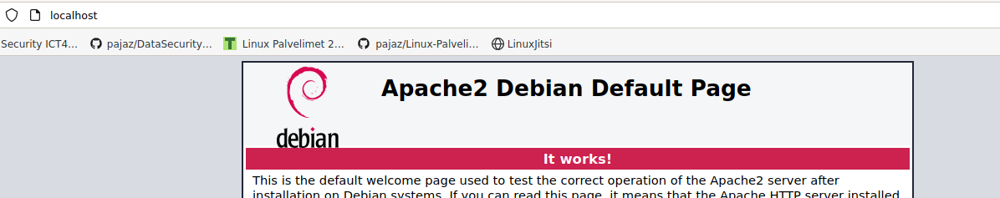
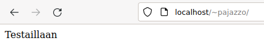
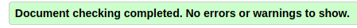
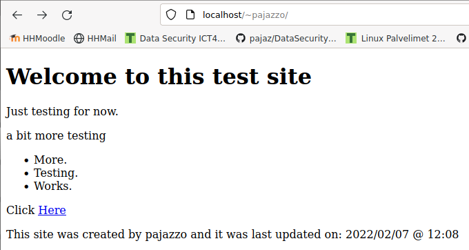
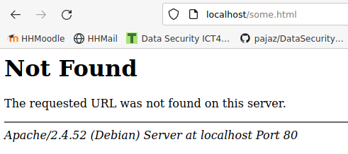
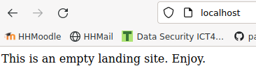
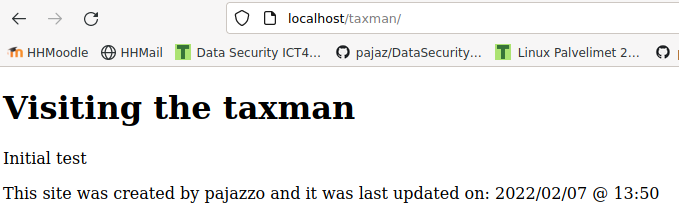
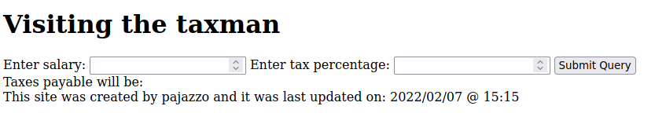
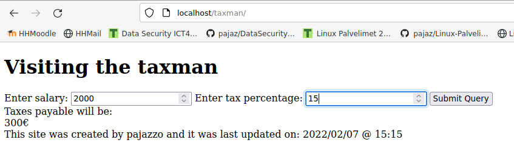

h3

Apassi

Tee viisi vapaavalintaista kohtaa. Säädä vaikeustaso oikeaksi: helpoimmat ovat
ensimmäiset a b c d e. Jos osaat jo perusteet, tee useampia tai vaikeampia
kohtia. Tarkoitus on, että tehtävät tehtyäsi osaat enemmän kuin osasit ennen.
Tee tehtävät alusta lähtien koneella, vaikka olisitkin kokeillut samaa asiaa
tunnilla.

* a) Asenna Apache ja osoita testillä, että se toimii.  
Start time: 2022/02/07T11:21
sudo apt-get install apache2  
pajazzo@derpface:~/Projects/Linux-Palvelimet-2022$ sudo systemctl status apache2  
  apache2.service - The Apache HTTP Server  
     Loaded: loaded (/lib/systemd/system/apache2.service; enabled; vendor prese>  
     Active: active (running) since Mon 2022-02-07 11:21:19 EET; 30s ago  
       Docs: https://httpd.apache.org/docs/2.4/  
   Main PID: 7681 (apache2)  
      Tasks: 55 (limit: 9360)  
     Memory: 20.9M  
        CPU: 27ms  
     CGroup: /system.slice/apache2.service  
             ├─7681 /usr/sbin/apache2 -k start  
             ├─7683 /usr/sbin/apache2 -k start  
             └─7684 /usr/sbin/apache2 -k start  

Feb 07 11:21:19 derpface systemd[1]: Starting The Apache HTTP Server...  
Feb 07 11:21:19 derpface apachectl[7680]: AH00558: apache2: Could not reliably >  
Feb 07 11:21:19 derpface systemd[1]: Started The Apache HTTP Server.  

Kuten edellisestä nähdään Apache2 on active (running) tilassa.  
localhost/ osoitteesta löytyy selaimella Apachen oletussivu.  
  

Finished: 2022/02/07T11:26  

* b) Laita käyttäjien kotisivut (http://example.com/~tero) toimimaan. Testaa esimerkkikotisivulla.  

Start time: 2022/02/07T11:33  

pajazzo@derpface:~/Projects/Linux-Palvelimet-2022$ sudo a2enmod userdir  
Enabling module userdir.  
To activate the new configuration, you need to run:  
  systemctl restart apache2  
pajazzo@derpface:~/Projects/Linux-Palvelimet-2022$ sudo systemctl restart apache2  
pajazzo@derpface:~$ mkdir public_html  
pajazzo@derpface:~$ ls -l | grep public_html  
drwxr-xr-x 2 pajazzo pajazzo  4096 Feb  7 11:39 public_html  
pajazzo@derpface:~$ cd public_html/  
pajazzo@derpface:~/public_html$ nano index.html  

Lisäsin index.html tiedostoon vähän tekstiä ja nyt sivut toimivat:  
  
  
Finished: 2022/02/07T11:42   

* c) Tee validi HTML5 sivu, ja testaa sen toiminta https://validator.w3.org  

Start time: 2022/02/07T12:00

Tein pikaisesti [HTML](myhtml.html)-sivun, jonka ajoin validaattorin läpi.  
  
  
Laitoin tiedoston sisällö myös index.html:n sisällöksi palvelimelleni.  

Finished: 2022/02/07T12:10

* d) Surffaa oman palvelimesi weppisivuja. Etsi Apachen lokista esimerkki onnistuneesta (200 ok) sivulatauksesta ja epäonnistuneesta (esim 404 not found) sivulatauksesta. Analysoi rivit eli kerro jokaisesta rivistä niin paljon yksityiskohtia kuin osaat.  

Start time: 2022/02/07T12:11  

Loin index sivulleni relative linkin tiedostoon some.html, mikä varmasti aiheuttaa virheen, ettei sivua löydy. Testi, ja näin tosiaan tapahtui:  
 ----->   
  
Apache lokit:  
`pajazzo@derpface:/$ cd var/log/`  
`pajazzo@derpface:/var/log$ ls apache2/`  
`ls: cannot open directory 'apache2/': Permission denied`  
`pajazzo@derpface:/var/log$ sudo ls apache2/`  
`access.log  error.log  other_vhosts_access.log`  
`pajazzo@derpface:/var/log$ sudo less apache2/error.log` <-- Täällä ei ollut mitään mielenkiintoista toistaiseksi.  
`pajazzo@derpface:/var/log$ sudo less apache2/access.log`  

Epäonnistunut tapahtuma:  
`127.0.0.1 - - [07/Feb/2022:12:17:44 +0200] "GET /some.html HTTP/1.1" 404 488 "http://localhost/~pajazzo/" "Mozilla/5.0 (X11; Linux x86_64; rv:91.0) Gecko/20100101 Firefox/91.0"`  
  
Puretaan ylempää osiin [tämän](https://httpd.apache.org/docs/current/logs.html#common) tulkintaohjeen mukaisesti:  
127.0.0.1: IP-osoite josta pyyntö tapahtumalle tuli. Tällä kertaa se taitaakin olla palvelimen oma osoite, koska käytin selainta samalla koneella.  
-: Tieto ei saatavilla. Pitäisi sisällään RCF 1413 identiteetin (ident). Jos ymmärsin oikein, tämä on käyttäjän koneen ilmoittama ja erittäin epäluotettava tieto muutenkin.  
-: HTTP tunnistautumisen ilmoittama käyttäjätunniste, joka tässä tapauksessa myös tyhjä.  
[07/Feb/2022:12:17:44 +0200]: Päivämäärä, kellonaika ja aikavyöhyke +-UTF muodossa.  
"GET /some.html HTTP/1.1": Pyynnön tyyppi eli GET, mitä resurssia pyyntö koskee (/some.html) ja mitä protokollaa on käytetty HTTP/1.1  
404: Statuskoodi, jonka palvelin ilmoitti takaisin käyttäjälle.  [404](https://en.wikipedia.org/wiki/HTTP_404) eli sivua ei löydy.  
488: Käyttäjälle palautetun tiedoston koko bitteinä.  
"http://localhost/~pajazzo/": Miltä sivulta pyyntö tuli eli tässä tapauksessa sivu jolla käyttäjä oli, kun klikkasi rikkinäistä linkkiä.  
"Mozilla/5.0 (X11; Linux x86_64; rv:91.0) Gecko/20100101 Firefox/91.0"`: Järjestelmä ja selaintiedot jotka käyttäjän selain ilmoitti.  

Tuntemattomaksi jäänyt käyttäjä yritti IP-osoitteesta 127.0.0.1 pyytää tarjoamaan resurssia /some.html sivun http://localhost/~pajazzo/ kautta. Käyttäjälle ilmoitettiin virhe 404 sivua ei löydy, koska kyseistä sivua ei ole olemassa. Käyttäjän selain ilmoitti pyynnön yhteydessä olevansa Mozilla Firefox 91.0 ja toimivansa 64-bittisellä x86 arkkitehtuurin (https://en.wikipedia.org/wiki/X86) Linux-käyttöjärjestelmällä. Suositellaan korjaamaan kyseinen linkki sivulla.   
   
Onnistunut tapahtuma:  
`127.0.0.1 - - [07/Feb/2022:12:15:06 +0200] "GET /~pajazzo/ HTTP/1.1" 200 733 "-" "Mozilla/5.0 (X11; Linux x86_64; rv:91.0) Gecko/20100101 Firefox/91.0"`  
  
Tässä ei ole muuta eroa edelliseen kuin statuskoodin muuttuminen sekä sivu jonka kautta pyyntö tehtiin.  
200 tarkoittaa onnistunutta pyyntöä.  
\- referoivan sivun kohdalla todennäköisesti tarkoittaa, että käyttäjä kirjoitti sivun osoitteen kokonaisuudessaan selaimen osoitekenttään.   
  
Finished: 2022/02/07T13:24  
  
* e) Vaihda Apachen esimerkkisivu johonkin lyhyeen sivuun niin, että vanha esimerkkisivu ei näy. (Tämä lienee ainoa kohta, jossa ikinä muokkaat weppisivua pääkäyttäjän oikeuksin. /var/www/html/index.html)  
  
Start time: 2022/02/07T13:26

`pajazzo@derpface:/var/www/html$ cd /`  
`pajazzo@derpface:/$ cd /var/`  
`backups/ lib/     lock/    mail/    run/     tmp/     `  
`cache/   local/   log/     opt/     spool/   www/     `  
`pajazzo@derpface:/$ cd /var/www/html/`  
`pajazzo@derpface:/var/www/html$ ls`  
`index.html`  
`pajazzo@derpface:/var/www/html$ sudo gedit index.html`  
  
  
  
Finished: 2022/02/07T13:30    

* f) Tee virhe johonkin Apachen asetustiedostoon, etsi ja analysoi tuo rivi. Etsimiseen sopivat esimerkiksi Apachen omat lokit, syslog sekä ‘apache2ctl
  configtest’.  
* g) Tee virhe weppipalvelimella ajettavaan koodiin (esim PHP tai Python), etsi se lokista ja analysoi tuo lokirivi  
* h) Asenna ja kokeile PhpMyAdmin:a tai jotain muuta valmista weppiliittymää tietokantojen hallinnointiin.  
* i) Tee palvelimella ajettava weppiohjelma, joka tekee käyttäjälle jonkin yksinkertaisen laskun (esim. painoindeksi BMI)  

Start time: 2022/02/07T13:39  

Lähde: https://www.digitalocean.com/community/tutorials/how-to-set-up-apache-virtual-hosts-on-ubuntu-18-04  
Ohjeet sivulla ovat Ubuntulle, mutta kaikki komennot ja kansiorakenteet näyttävät identtisiltä Debian 11 kanssa eli käytän tätä. Sivu myös selittää vaiheet suhteellisen ymmärrettävästi.  
  
Onnistuin vahingossa poistumaan terminaalista, mutta tässä historian (history) kautta käytetyt komennot:  
2081  sudo mkdir taxman  ## Luotiin kansio sovellukselle /var/www/html/taxman  
2082  sudo chown -R $USER:$USER /var/www/html/taxman  ## Asetettiin kansion oikeudet kuntoon chown (change owner) -komennolla. ja sen -R optio ilmoittaa, että oikeudet muutetaan rekursiivisesti kaikille alikansioille ja tiedostoille.  
2083  sudo chmod -R 755 /var/www/html/taxman/  ## Annetaan lukuoikeudet ja suoritusoikeudet ryhmän jäsenille ja muille. Täydet oikeudet omistajalle.  
ls -l palauttaa seuraavaa:  
drwxr-xr-x 2 pajazzo pajazzo 4096 Feb  7 13:50 taxman  
2085  sudo gedit taxman/index.html   ## Kotisivun luonti  
2086  sudo nano /etc/apache2/sites-available/taxman.conf ## Sivun konfiguraation luonti.  
Konfiguraatiotiedoston sisältö:  
<\VirtualHost *:80> ## Tämä osio määrittää, että VirtualHost kuuntelee kaikkia porttiin 80 tehtyjä pyyntöjä. 80 on HTTP:n vakioportti.  
    ServerAdmin admin@taxman.com    ## Adminin sähköpostiosoite  
    ServerName taxman.com           ## Palvelimen nimi (laitoin tähän nyt vähän satunnaisen osoitteen  
    ServerAlias www.taxman.com      ## Muita nimiä, jotka käsittellään kuin ne olisivat Palvelimen nimi  
    DocumentRoot /var/www/taxman    ## TÄRKEÄ, eli sovelluksen juuri  
    ErrorLog ${APACHE_LOG_DIR}/error.log    ## Sovelluksen virhelokin kirjoitussijainti, vakio  
    CustomLog ${APACHE_LOG_DIR}/access.log combined   ## Sovelluksen accesslogin kirjoitussijanti, vakio  
<\/VirtualHost>
  
2087  sudo a2ensite taxman.conf   ## Aktivoidaan sivu taxman  
2088  sudo systemctl reload apache2  ## Ladataan apache2 komponentit uudelleen.  
  
Testataan, että sivu lähti toimimaan:   
  
Tehdään sovellukselle lomake, joka pyytää palkkaa ja veroprosenttia syötteenä, sekä elementti johon vastaus lopulta syötetään.     
Tehdään sovellukselle javascript kansio ja tiedosto js.js johon kirjoitetaan simppeli funktio, joka laskee verot syötetyn palkan ja veroprosentin mukaan, sekä syöttää vastauksen sille määritellylle paikalle sivulla.  
Lisätään index.html tiedostoon <\script>"javascript/js.js"<\script> osio, jotta kutsutut funktiot haetaan oikeasta paikasta.  
Lisätään lomakkeelle submit painike, joka kutsuu äskettäin tehtyä funktioita painettaessa.  

Testataan toimintaa:   
  
  
  
  
Finished: 2022/02/07T15:50

* j) Tee palvelimella ajettava weppiohjelma, joka käyttää tietokantaa. Voit tehdä jonkin yksinkertaisen CRUD-ohjelman, esimerkiksi TODO-listan  
* k) Tee Apachelle uusi sivu, joka näkyy suoraan palvelimen pääsivulla, mutta jonka sivuja voi muokata normaalin käyttäjän oikeuksilla (name based virtual host, DocumentRoot käyttäjän kotihakemistoon).  
* i) Kuinka monta eri HTTP Status:ta (200, 404, 500…) saat aiheutettua lokeihin? Selitä, miten aiheutit tilanteet ja analysoi yksi rivi kustakin statuksesta.  
* l) Asenna LAMP (Linux, Apache, MySQL, PHP). Testaa kunkin komponentin toiminta. Testaa lopuksi kokonaisuus. (Voit aloittaa tilanteesta, jossa Linux-käyttöjärjestelmä on jo asennettu, mutta ei muita (AMP) osia.  
* m) Kokeile jotain Flaskin uutta ominaisuutta flask-testipalvelimessa. Voit kokeilla esim. muotteja (templates), tietokantaa tai syötteiden ottamista lomakkeilta (forms).  
* n) Asenna Python Flask + PostgreSQL + Apache mod WSGI. Testaa kunkin komponentin toiminta. Testaa lopuksi kokonaisuus. (vaikea) ja voit muokata sitä ilman pääkäyttäjän oikeuksia.  
* o) Laita kaksi nimeä samaan IP-osoitteeseen. Voit simuloida nimipalvelun toimintaa /etc/hosts -tiedoston avulla. Eli niin, että samalla palvelimella osoitteella teronlenkkisivu.com tulee eri sisältö kuin osoitteella opipentest.com.  
