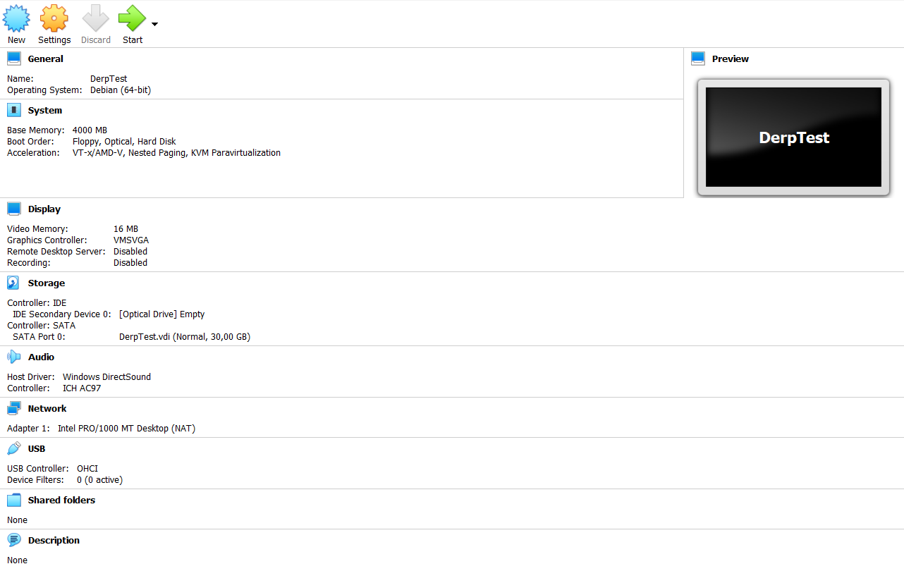
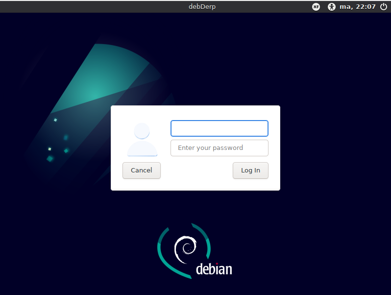
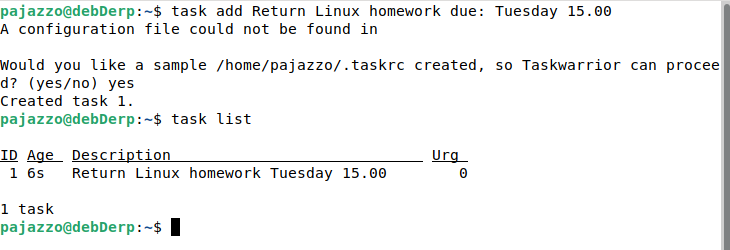
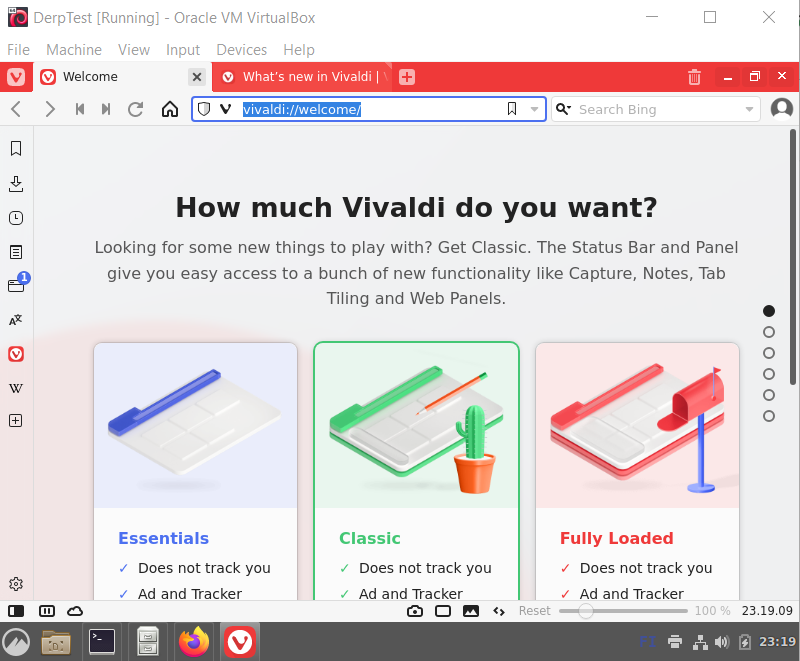
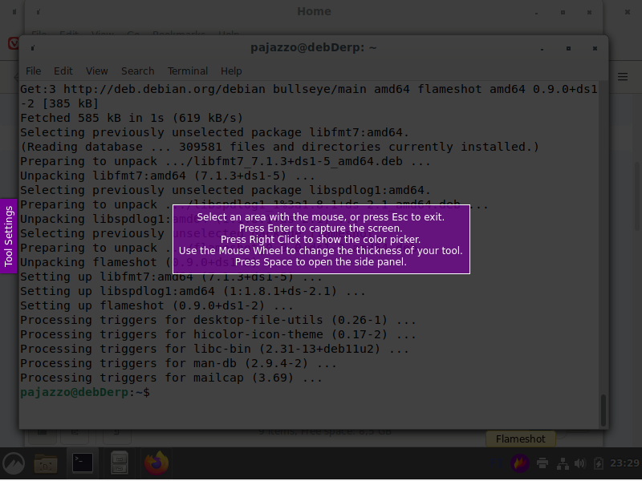

# Luento 1 Kotitehtävät

## Z) Lue ja tiivistä. Tiivistelmäksi riittää muutama ranskalainen viiva per artikkeli. (Tässä z-alakohdassa ei tarvitse tehdä testejä tietokoneella)

### FSF: [FSF Free Software Definition](https://www.gnu.org/philosophy/free-sw.html)

* Vapaan lisenssin sovellukset tarkoittavat sovelluksia (koodia, sovellusta itseään, se, sekä sen oheistuotteita, kuten manuaaleja) joita saa **käyttää, kopioida, jakaa, muuttaa, tutkia ja kehittää**, myös myyntitarkoituksessa. Vapaa ei kuitenkaan ole synonyymi ilmaisella, koska ollakseen todella vapaa, tulee lisenssin sallia kaikenlainen käyttö, siis myös kaupallinen. 
* Vapauden tulee koskea sovellusta itseään, siihen käytettyä koodia, jatkokehitettyjä sovelluksia sekä sovelluksen käyttöohjeita.  
* Omisteiset ("proprietary") tai "nonfree" sovellukset ovat vapaan lisenssin sovellusten vastakohta. Tällaiset sovellukset rajoittavat käyttäjän toimintaa ja pitävät kaikki narut kehittäjän käsissä.  
* Vapaissa lisensseissä voi olla reunaehtoja, kuten vaatimus jatkokehitetyn sovelluksen nimen muuttamisesta tai alkuperäisten logojen poistamisesta, mutta ehdot eivät saa rajoittaa yhtäkään neljästä vapaan sovelluksen ehdoista:  
    * Vapaus käyttää sovellusta kuten käyttäjä haluaa, kaikkiin tarkoituksiin.  
    * Vapaus tutkia, miten sovellus toimii ja muuttaa sovellusta niin, että se toimii käyttäjän toivomusten mukaisesti. Edellytyksenä tähän on lähdekoodin avoimuus.  
    * Vapaus jakaa sovellusta, jotta käyttäjä voi auttaa muita.  
    * Vapaus jakaa muunneltua versiota sovelluksesta muille.  
* Suositellaan Copyleftiä Copyrightin sijaan. Erittäin vahvasti yksinkertaistettuna Copyleftillä tarkoittaa, että sovelluksen uudelleenjakelussa ei saa lisätä ehtoja jotka rajoittavat muiden ihmisten keskeisiä oikeuksia.   

### Karvinen 2021: [Install Debian on VirtualBox](https://terokarvinen.com/2021/install-debian-on-virtualbox)

* Yksityiskohtainen ja helposti noudatettava ohjeistus asennukseen.  
* Mukava lisä lopun huomautus asentaa Guest Additionsit Virtual Box asennukselle. Ovat todella hyödylliset.  

### Karvinen 2016: [Raportin kirjoittaminen](https://terokarvinen.com/2006/raportin-kirjoittaminen-4)

* Hyvällä raportilla on selkeä ulkoasu ja hyvä kieliasu. Siinä on lähdeviittaukset kunnossa ja etenkin työasemilla tehtävässä testauksessa raportointi on täsmällistä ja käytetyt komennot selostettu kohta kohdalta.  
* Todella hyvä vinkkejä raportointiin.

### Välimäki 2005: [Rise of Open Source](http://lib.tkk.fi/Diss/2005/isbn9529187793/isbn9529187793.pdf): 5 Open Source Licenses as Alternative Governance Mechanisms: 5.1.1 - 5.1.4 (sivu 113 - 121)  

* Artikkeli käsittelee suhteellisen syväluotaavasti Open Source lisenssejä, niiden luokittelua käyttötarkoituksen tai historiallisuuden kautta, sekä lainopillista näkökulmaa lisenssien ehtojen toteuttamisessa/rikkomisessa.  
* Valitettavasit minulla loppui aika ja artikkelin teksti oli osaaltaan todella hankalasti ymmärrettävää. Vaikka ymmärsin sanat, en aina ymmärtänyt, mitä kappaleessa yritettiin sanoa.  

## A) Asenna Linux joko 1) VirtualBoxiin (helpompaa) tai 2) Kokeile omaa Linux-tikkua raudalla. Tämä kohta ei vaadi asentamista suoraan raudalle (koneelle ilman virtualisointia) – jos kuitenkin asennat, ota ensin varmuuskopiot. Jos sinulla on jo Linux virtuaalikoneessa, voit kokeilla tikkua raudalla tai tehdä toisen asennuksen raportointia varten  

Minulla on jo Linux Debian dualboottina Windowsin kanssa ja virtuaalikoneelle asennettu Debian 11 Linuxin puolella. Teen tässä tehtävässä asennuksen käyttäen virtuaalikoneen hostina Windows 10 käyttöjärjestelmää.  

Asensin Virtualboxin Windows hostin https://www.virtualbox.org/wiki/Downloads sivulta ladatulla Installerilla. En tehnyt asetuksiin muutoksia asennuksen yhteydessä.  
Loin 64-bittisen Linux VM:n  

  

Virtuaalikoneen käynnistys ja mountattu debian-live-11.2.0-amd64-xfce+nonfree.iso tiedosto. (Debian 11 live non-free).  
Boottasin GNU/Linux Live (kernel 5.10.0-10-amd64) vaihtoehtoon.  
Testaus, että menut ja selaimet toimivat, verkkoyhteys ok.  
Työpöydältä käyntiin Installer.  

Asennus:  
Language: American English  
Location: Helsinki  
Keyboard: Default Finnish  
Partitions  
Erase Disk: \[X\]  
Encrypt system: \[\]  
Boot loader location: Master Boot Record of VBOX HARDDISK (/dev/sda)  

Täytetään käyttäjätiedot ja tietokoneen nimi + salasana    
Log in automatically without asking for the password: \[\]  
Summary vaiheessa tarkistettu tiedot. Näyttää hyvältä.  
Installing...
15 minuutin jälkeen asennus valmis.     
Reboot.

  

Kirjautuminen onnistu.  
Verkkoyhteys toimii, sovellukset aukeavat.  
Terminaali auki (CTRL+ALT+T)  
Päivitykset:   
sudo apt-get update  
sudo apt-get -y dist-upgrade  
10 minuuttia siinä meni ja huomasin, että Linuxin kernel päivitys tuli myös. Reboot.  
Rebootin jälkeen kaikki yhä kunnossa.  
  
Tässä välissä asensin vielä Debianin tasksel komennon avulla Cinnamon työpöytäympäristön, koska olen tottunut siihen.  
* sudo tasksel (Liikkuminen nuolinäppäimillä ja välilyönti valitsee asennettavat. Lopuksi Enter)  
  

## B) Listaa testaamasi koneen rauta (‘sudo lshw -short -sanitize’). Selitä listaus.  

sudo lshw -short -sanitize palautti virheen:   
sudo: lshw: command not found  
sudo apt-get install lshw  
sudo lshw -short -sanitize  
Palautuu lista työaseman laitteista.  
Ensimmäinen kolumni ilmoittaa portin johon laite on kytketty.  
Toinen kolumni ilmoittaa laitteen mount pointin Linuxin tiedostojärjestelmän sisällä.
Kolmas kolumni on laitteen tyyppi  
Neljännessä tarkemmat laitetiedot.  
  
## C) Asenna kolme itsellesi uutta ohjelmaa. Kokeile kutakin ohjelmaa sen pääasiallisessa käyttötarkoituksessa. Ota ruutukaappaus.  

Taskwarrior  
sudo apt-get install taskwarrior  
  

https://taskwarrior.org/docs/start.html  
https://taskwarrior.org/docs/commands/  

Vivaldi selain  
Ladataan asennustiedosto (curlin -o handle määrittää, että kohde ladataan koneelle):  
curl -o https://downloads.vivaldi.com/stable/vivaldi-stable_5.0.2497.48-1_amd64.deb  
Asennetaan (-i = install):  
sudo dpkg -i vivaldi-stable_5.0.2497.48-1_amd64.deb  
Päädytään virheeseen, koska vivaldin asennus on riippuvainen wget istä.  
sudo apt-get install wget  
sudo dpkg -i vivaldi-stable_5.0.2497.48-1_amd64.deb  
  
  
Flameshot kuvakaappaustyökalu  
sudo apt install flameshot  
  
  
## D) Mitä lisenssiä kukin näistä ohjelmista käyttää? Selitä lyhyesti, mitä oikeuksia ja velvollisuuksia tuosta lisenssistä seuraa  
  
### Taskwarrior  
The MIT License
https://taskwarrior.org/docs/license.html  

#### The MIT License (https://www.opensource.org/licenses/mit-license.php)

Sovellusta saa käyttää, muokata, jakaa, tutkia omien halujensa mukaan.  
Ainoana ehtona, on että MIT Licensen Copyright teksti liitetään mukaan sovelluksen kopioihin tai huomattaviin osiin sovelluksesta. Jälkimmäisen edellisistä ymmärrän niin, että jos sovelluksesta tehdän muokattu versio, joka pitää sisällään huomattavan osan alkuperäisestä, copyright teksti on liitettävä tähän sovellukseen. Tällainen ehto on hieman ympäripyöreä, koska huomattavuuden määritelmä on hyvin joustava.  
Sovelluksella ei myöskään MIT Lisenssin myötä ole minkäänlaista takuuta eivätkä tekijänoikeuksien omistajat tai valmista ota mitään vastuuta sovelluksen käytöstä aiheutuvalle haitalle.  

### Vivaldi
Ei ole minkään yhden Open Source lisenssin alla.  
Muutokset Chromium lähdekoodiin tehty BSD lisenssin mukaisesti ja Vivaldi tarjoaa käyttöliittymänsä koodin selkomuodossa luettavaksi.
https://help.vivaldi.com/desktop/privacy/is-vivaldi-open-source/

### Flameshot  
Pääkoodi käyttää GPLv3 (GNU General Public License v3) lisenssiä  
Logo Free Art Licence v1.3  
Painikkeiden ikonit Apache License 2.0  
https://flameshot.org/docs/overview/overview/  

#### GNU (https://www.gnu.org/licenses/quick-guide-gplv3.html, )
Käyttäjien oikeudet:  
Vapaus käyttää sovellusta mihin vain tarkoitukseen  
Vapaus muuttaa sovellusta omiin tarkoituksiinsa. Eli myös sovelluksen lähdekoodin on oltava saatavilla ymmärrettävässä muodossa.  
Vapaus jakaa sovellusta eteenpäin  
Vapaus jakaa tekemiään muutoksia  

Sovelluksen omistajan velvollisuus on olla rikkomatta edellä mainittuja kohtia.  
Omistaja ei saa esimerkiksi vaatia korvausta tai tiedoksiantoa, kun sovelluksen kopioita tai muunneltuja versioita jaetaan eteenpäin. Omistaja voi kuitenkin halutessaan veloittaa omasuorittamastaan jakelusta.

#### Artistic License (https://www.perlfoundation.org/artistic-license-20.html)
Käyttäjän oikeudet:  
Oikeus käyttää ja muokata tuotetta omiin käyttötarkoituksiinsa.
Oikeus sovelluksen edelleenjakeluun joko ilmaiseksi tai välitysmaksua vastaan, kunhan kaikki sisällytetyt tekijänoikeushuomautukset pysyvät mukana.  
Muokatun version jakelu on kuitenkin sallittua vain tiettyjen ehtojen täyttyessä kuten ilmoitus alkuperäisen version tekijänoikeuksien omistajalle.  
  
## E) Vapaaehtoinen lisätehtävä: Listaa käyttämäsi ohjelmat (esim. MS Word), kunkin ohjelman käyttötarkoitus (esim. Tekstinkäsittely) ja vastaava vapaa Linux-ohjelma (esim. LibreOffice Writer). Jos johonkin tarkoitukseen ei löydy vapaata Linux-ohjelmaa, listaa sekin.

## F) Vapaaehtoinen lisätehtävä: varmuuskopioi tiedostosi (voit käyttää esimerkiksi ulkoista USB-levyä)
